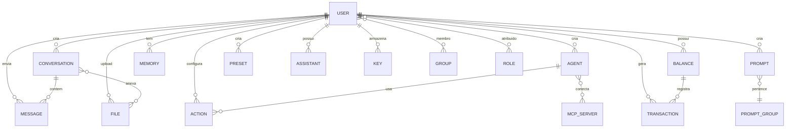
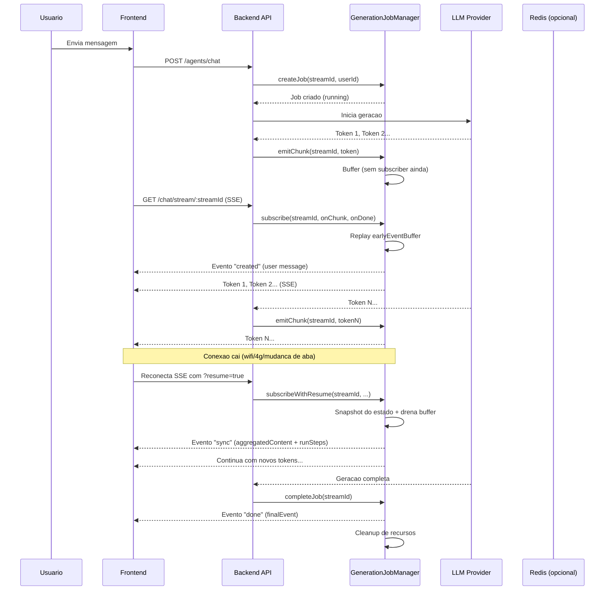
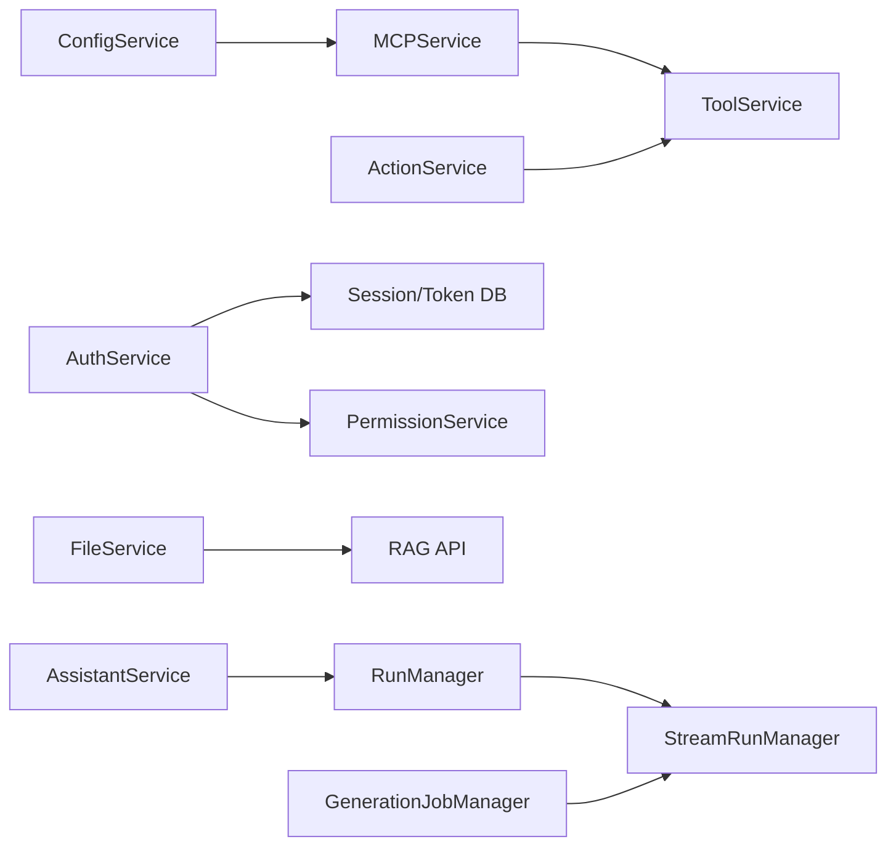

# Arquitetura - Orqest (LibreChat Fork)

> Documentacao tecnica gerada em 2026-04-29

## Stack Tecnologico

| Camada | Tecnologia | Versao |
|--------|-----------|--------|
| Frontend | React 18 + Vite | ^18.0 |
| Backend | Express.js (legacy CJS) + packages/api (TS/CJS) | ^4.18 |
| Banco | MongoDB 8.0 (Mongoose) | 8.0.20 |
| Search | Meilisearch | v1.35.1 |
| Vector DB | PostgreSQL + pgvector | 15 + 0.8.0 |
| Auth | Passport.js + JWT + bcryptjs | - |
| UI | Tailwind CSS + shadcn/ui + Radix UI | ^3.4 |
| State Client | Recoil + React Query v4 | - |
| Cache | Keyv (Redis-compatible) | - |
| Testes | Jest + Playwright | ^30.2 / ^1.56 |
| Build | Rollup (packages) + Vite (client) | - |
| Monorepo | npm workspaces + Turborepo | ^2.8.12 |
| Deploy | Docker Compose / Vercel | - |

## Estrutura de Diretorios

```
/
├── api/                          # Backend legacy (Express CJS, entrypoint)
│   ├── app/clients/              # Clientes de IA (LangChain, SDKs)
│   ├── server/
│   │   ├── controllers/          # Controllers Express
│   │   ├── middleware/           # Auth, rate limiting, validacao
│   │   ├── routes/               # Rotas API (~22k linhas)
│   │   ├── services/             # Logica de negocio
│   │   └── utils/                # Utilitarios, emails, import
│   ├── strategies/               # Passport strategies (OAuth, LDAP, SAML)
│   └── models/                   # Acesso a dados (legacy)
├── client/                       # Frontend SPA (React + Vite)
│   ├── src/components/           # Componentes React (~30 modulos)
│   ├── src/hooks/                # Custom hooks
│   ├── src/data-provider/        # Cliente API local
│   ├── src/routes/               # Rotas React Router v6
│   └── src/store/                # Estado Recoil
├── packages/
│   ├── data-provider/            # Tipos, schemas Zod, endpoints, data-service
│   ├── data-schemas/             # Mongoose schemas + models (multi-tenant)
│   ├── api/                      # Novo backend TS (CRUD, auth, cache, stream)
│   └── client/                   # Componentes/utilitarios compartilhados
├── config/                       # Scripts CLI (update, create-user, etc.)
├── e2e/                          # Testes Playwright
└── docs/                         # Documentacao
```

### Descricao dos Diretorios

| Diretorio | Proposito |
|-----------|-----------|
| `api/server/routes/` | ~25 grupos de rotas REST (auth, convos, messages, agents, files, etc.) |
| `api/server/services/` | Orquestracao de logica: AuthService, ActionService, MCP, Runs, Threads |
| `api/app/clients/` | Clientes de provedores de IA (OpenAI, Anthropic, Google, etc.) |
| `packages/data-schemas/src/schema/` | 28 schemas Mongoose com tenantId e plugins |
| `packages/data-schemas/src/models/` | Factories de modelos com tenant isolation |
| `packages/api/src/` | Novo backend TS: auth, endpoints, files, mcp, stream, tools |
| `client/src/components/Chat/` | Interface principal de chat, input, mensagens |
| `client/src/components/SidePanel/` | Painel lateral (Agents, Files, MCP, Memories) |
| `client/src/hooks/` | Hooks de dominio (Chat, Auth, Agents, Audio, Config) |

## Modelo de Dados

### Diagrama ER (Mermaid)



### Tabelas/Colecoes Principais

#### `User`
| Coluna | Tipo | Descricao |
|--------|------|-----------|
| `name` | String | Nome de exibicao |
| `username` | String | Username (lowercase) |
| `email` | String | Email unico (indexado) |
| `emailVerified` | Boolean | Email confirmado |
| `password` | String | Hash bcrypt (select: false) |
| `avatar` | String | URL do avatar |
| `provider` | String | Provedor de auth (local, google, github, etc.) |
| `role` | String | Papel do sistema (USER, ADMIN, etc.) |
| `googleId` / `githubId` / etc. | String | IDs OAuth |
| `twoFactorEnabled` | Boolean | 2FA ativo |
| `totpSecret` | String | Secreto TOTP (select: false) |
| `backupCodes` | Array | Codigos de backup (select: false) |
| `refreshToken` | Array | Tokens de refresh |
| `termsAccepted` | Boolean | Termos aceitos |
| `personalization` | Object | Preferencias (memories on/off) |
| `favorites` | Array | Favoritos (agentId, model, endpoint) |
| `tenantId` | String | Isolamento multi-tenant |
| `timestamps` | Date | createdAt, updatedAt |

#### `Conversation`
| Coluna | Tipo | Descricao |
|--------|------|-----------|
| `conversationId` | String | UUID da conversa (index, meiliIndex) |
| `title` | String | Titulo (default: "New Chat", meiliIndex) |
| `user` | String | ID do usuario (index, meiliIndex) |
| `messages` | ObjectId[] | Refs para Message |
| `agent_id` | String | Agente associado |
| `tags` | String[] | Tags para organizacao (meiliIndex) |
| `files` | String[] | Arquivos anexados |
| `expiredAt` | Date | TTL de expiracao |
| `tenantId` | String | Isolamento multi-tenant |
| `timestamps` | Date | createdAt, updatedAt |

#### `Message`
| Coluna | Tipo | Descricao |
|--------|------|-----------|
| `messageId` | String | UUID da mensagem (index, meiliIndex) |
| `conversationId` | String | UUID da conversa (index, meiliIndex) |
| `user` | String | ID do usuario (index, meiliIndex) |
| `model` | String | Modelo utilizado |
| `endpoint` | String | Provedor utilizado |
| `parentMessageId` | String | Para threading/branching |
| `tokenCount` | Number | Tokens da mensagem |
| `sender` | String | Remetente (meiliIndex) |
| `text` | String | Texto (meiliIndex) |
| `content` | Mixed[] | Partes multimodais (meiliIndex) |
| `files` | Mixed[] | Arquivos anexados |
| `attachments` | Mixed[] | Anexos processados |
| `feedback` | Object | Avaliacao (thumbsUp/thumbsDown) |
| `isCreatedByUser` | Boolean | Mensagem do usuario |
| `unfinished` | Boolean | Stream incompleto |
| `error` | Boolean | Erro na geracao |
| `expiredAt` | Date | TTL de expiracao |
| `tenantId` | String | Isolamento multi-tenant |
| `timestamps` | Date | createdAt, updatedAt |

#### `Agent`
| Coluna | Tipo | Descricao |
|--------|------|-----------|
| `id` | String | UUID do agente (unique com tenantId) |
| `name` | String | Nome do agente |
| `description` | String | Descricao |
| `instructions` | String | Instrucoes de sistema |
| `provider` | String | Provedor de IA |
| `model` | String | Modelo de IA |
| `model_parameters` | Object | Parametros (temperature, etc.) |
| `tools` | String[] | IDs de ferramentas |
| `actions` | String[] | IDs de actions |
| `author` | ObjectId | Ref: User (criador) |
| `access_level` | Number | Nivel de acesso |
| `category` | String | Categoria (default: "general") |
| `edges` | Mixed[] | Conexoes entre agentes |
| `conversation_starters` | String[] | Sugestoes de inicio |
| `tool_resources` | Mixed | Recursos de ferramentas |
| `mcpServerNames` | String[] | MCP servers vinculados |
| `tenantId` | String | Isolamento multi-tenant |

#### `File`
| Coluna | Tipo | Descricao |
|--------|------|-----------|
| `user` | ObjectId | Ref: User |
| `conversationId` | String | Ref: Conversation |
| `messageId` | String | ID da mensagem |
| `file_id` | String | UUID do arquivo (unique context) |
| `bytes` | Number | Tamanho |
| `filename` | String | Nome original |
| `filepath` | String | Caminho de storage |
| `type` | String | MIME type |
| `source` | String | Fonte (local, s3, firebase) |
| `context` | String | Contexto (execute_code, etc.) |
| `usage` | Number | Contador de uso |
| `expiresAt` | Date | TTL (1h para temp) |
| `tenantId` | String | Isolamento multi-tenant |

#### `Balance`
| Coluna | Tipo | Descricao |
|--------|------|-----------|
| `user` | ObjectId | Ref: User |
| `tokenCredits` | Number | Creditos disponiveis |
| `autoRefillEnabled` | Boolean | Recarga automatica |
| `refillIntervalValue` | Number | Intervalo de recarga |
| `refillIntervalUnit` | String | Unidade (days, weeks, etc.) |
| `refillAmount` | Number | Valor da recarga |
| `lastRefill` | Date | Ultima recarga |
| `tenantId` | String | Isolamento multi-tenant |

#### `Transaction`
| Coluna | Tipo | Descricao |
|--------|------|-----------|
| `user` | ObjectId | Ref: User |
| `conversationId` | String | Ref: Conversation |
| `tokenType` | String | Enum: prompt, completion, credits |
| `model` | String | Modelo utilizado |
| `rate` | Number | Taxa aplicada |
| `rawAmount` | Number | Quantidade bruta |
| `tokenValue` | Number | Valor em tokens |
| `inputTokens` | Number | Tokens de entrada |
| `writeTokens` / `readTokens` | Number | Tokens especificos |
| `tenantId` | String | Isolamento multi-tenant |

#### `Role`
| Coluna | Tipo | Descricao |
|--------|------|-----------|
| `name` | String | Nome do papel (unique com tenantId) |
| `description` | String | Descricao |
| `permissions` | Object | Sub-schema: bookmarks, prompts, memories, agents, mcp, etc. |
| `tenantId` | String | Isolamento multi-tenant |

#### `Group`
| Coluna | Tipo | Descricao |
|--------|------|-----------|
| `name` | String | Nome do grupo |
| `description` | String | Descricao |
| `email` | String | Email do grupo |
| `memberIds` | String[] | IDs dos membros |
| `source` | String | Fonte (local, entra) |
| `idOnTheSource` | String | ID externo (Entra ID) |
| `tenantId` | String | Isolamento multi-tenant |

#### `Memory`
| Coluna | Tipo | Descricao |
|--------|------|-----------|
| `userId` | ObjectId | Ref: User |
| `key` | String | Chave (a-z, underscore) |
| `value` | String | Valor armazenado |
| `tokenCount` | Number | Tokens do valor |
| `tenantId` | String | Isolamento multi-tenant |

### Convencoes de Banco
- **Isolamento Multi-Tenant**: Campo `tenantId` indexado em todas as colecoes.
- **Tenant Isolation Plugin**: Middleware Mongoose (`applyTenantIsolation`) injeta `tenantId` automaticamente em queries.
- **MeiliSearch Sync**: Plugin `mongoMeili` sincroniza `Conversation` e `Message` com Meilisearch quando `MEILI_HOST` esta configurado.
- **TTL**: Campos `expiredAt` e `expiresAt` com `expireAfterSeconds: 0` para limpeza automatica.
- **Indexacao Composta**: Padrao `{ id: 1, tenantId: 1 }` para unicidade por tenant.

## Services (Logica de Negocio)

### `AuthService`
**Arquivo:** `api/server/services/AuthService.js`

| Metodo | Descricao | Retorno |
|--------|-----------|---------|
| `loginUser()` | Autentica usuario, gera JWT e refresh token | `{ token, user }` |
| `logoutUser()` | Invalida sessao e refresh token | `{ status, message }` |
| `registerUser()` | Cria usuario com hash de senha | `User` |
| `verifyEmail()` | Verifica token de email | `boolean` |
| `resetPassword()` | Reseta senha via token | `boolean` |
| `refreshToken()` | Gera novo access token | `{ token }` |
| `setupTwoFactor()` | Configura TOTP | `{ secret, qrCode }` |
| `verifyTwoFactor()` | Verifica codigo TOTP | `boolean` |

### `ActionService`
**Arquivo:** `api/server/services/ActionService.js`

| Metodo | Descricao | Retorno |
|--------|-----------|---------|
| `loadAction()` | Carrega action com auth | `Action` |
| `createActionTool()` | Converte action em tool LangChain | `Tool` |
| `executeAction()` | Executa chamada HTTP da action | `Result` |

### `AssistantService`
**Arquivo:** `api/server/services/AssistantService.js`

| Metodo | Descricao | Retorno |
|--------|-----------|---------|
| `createAssistant()` | Cria assistant na API OpenAI | `Assistant` |
| `updateAssistant()` | Atualiza assistant | `Assistant` |
| `deleteAssistant()` | Remove assistant | `boolean` |

### `RunManager` / `StreamRunManager`
**Arquivo:** `api/server/services/Runs/`

| Metodo | Descricao | Retorno |
|--------|-----------|---------|
| `createRun()` | Inicia run do Assistants API | `Run` |
| `streamRun()` | Stream de eventos do run | `SSE Stream` |
| `cancelRun()` | Cancela run em andamento | `Run` |

### `MCPService`
**Arquivo:** `api/server/services/MCP.js` + `api/server/services/Tools/mcp.js`

| Metodo | Descricao | Retorno |
|--------|-----------|---------|
| `initializeMCPs()` | Inicializa servidores MCP | `void` |
| `getMCPTools()` | Lista ferramentas de um server | `Tool[]` |
| `callMCPTool()` | Executa ferramenta MCP | `Result` |

### `ConfigService`
**Arquivo:** `api/server/services/Config/`

| Metodo | Descricao | Retorno |
|--------|-----------|---------|
| `loadCustomConfig()` | Carrega `librechat.yaml` | `Config` |
| `loadConfigModels()` | Carrega modelos por endpoint | `Model[]` |
| `getEndpointsConfig()` | Retorna config de endpoints | `EndpointConfig` |
| `getCachedTools()` | Retorna tools cacheadas | `Tool[]` |

### `FileService`
**Arquivo:** `api/server/services/Files/`

| Metodo | Descricao | Retorno |
|--------|-----------|---------|
| `processFile()` | Processa upload (OCR, chunking) | `File` |
| `getFileStrategy()` | Resolve estrategia de storage | `local | s3 | firebase` |
| `deleteFile()` | Remove arquivo e refs | `boolean` |

### `PermissionService`
**Arquivo:** `api/server/services/PermissionService.js`

| Metodo | Descricao | Retorno |
|--------|-----------|---------|
| `checkPermission()` | Verifica permissao do usuario | `boolean` |
| `getRolePermissions()` | Lista permissoes do papel | `Permissions` |

### `GenerationJobManager`
**Arquivo:** `packages/api/src/stream/GenerationJobManager.ts` (~1305 linhas)

**Responsabilidade:** Orquestra os jobs de geracao de respostas de IA com suporte a **Resumable Streams** (streams retomaveis). E o coracao do sistema de streaming do Orqest.

| Metodo | Descricao | Retorno |
|--------|-----------|---------|
| `createJob(streamId, userId, conversationId)` | Cria job com estado serializavel (jobStore) + runtime (AbortController, earlyEventBuffer) | `GenerationJob` |
| `subscribe(streamId, onChunk, onDone, onError, options?)` | Cliente SSE conecta; faz replay do earlyEventBuffer; retorna unsubscribe | `Subscription \| null` |
| `subscribeWithResume(streamId, ...)` | Atomico: snapshot do estado + drena buffer + subscribe com skipBufferReplay | `{ subscription, resumeState, pendingEvents }` |
| `emitChunk(streamId, event)` | Emite token/evento; buffer se sem subscriber; persiste no Redis se habilitado | `void` |
| `getResumeState(streamId)` | Retorna estado completo para reconexao (aggregatedContent, runSteps, userMessage) | `ResumeState \| null` |
| `abortJob(streamId)` | Aborta geracao local + cross-replica; retorna conteudo parcial e usage | `AbortResult` |
| `completeJob(streamId, error?)` | Finaliza job; limpa recursos; mantem jobs com erro por ~60s para late subscribers | `void` |
| `emitDone(streamId, event)` / `emitError(streamId, error)` | Emite evento final; persiste no Redis para cross-replica | `void` |
| `markSyncSent(streamId)` / `wasSyncSent(streamId)` | Gerencia flag de sync para reconexoes | `void` / `boolean` |
| `updateMetadata(streamId, metadata)` / `setContentParts()` / `setCollectedUsage()` / `setGraph()` | Atualiza metadados e referencias do job | `void` |
| `getActiveJobIdsForUser(userId, tenantId?)` | Lista jobs ativos de um usuario (com self-healing) | `string[]` |
| `getRuntimeStats()` / `getJobCount()` / `getJobCountByStatus()` / `getStreamInfo()` | Diagnosticos e monitoramento | `varios` |
| `initialize()` / `configure(services)` / `destroy()` | Ciclo de vida do manager | `void` |

#### Arquitetura Interna: Duas Camadas Plugaveis

O `GenerationJobManager` e composto por dois servicos independentes via dependency injection:

| Camada | Responsabilidade | Implementacoes |
|--------|-----------------|---------------|
| **`jobStore`** | Metadados do job + estado do conteudo (chunks, run steps, usage) | `InMemoryJobStore` (default) ou `RedisJobStore` |
| **`eventTransport`** | Pub/sub de eventos em tempo real (SSE) | `InMemoryEventTransport` (default) ou `RedisEventTransport` |

Isso permite operar em **single-instance** (in-memory) ou **horizontalmente escalado** (Redis). Em producao multi-replica, o Redis garante que um job criado na Replica A seja acessivel pela Replica B.

#### Ciclo de Vida de um Job (Resumable Stream)



#### Mecanismos-Chave

**1. `earlyEventBuffer`**
- Array que guarda eventos emitidos antes do primeiro subscriber conectar
- Evita race condition onde tokens sao gerados mas o cliente ainda nao abriu o SSE
- Esvaziado automaticamente no primeiro `subscribe()` com replay para o cliente

**2. `readyPromise` (Legacy / Instant-Resolve)**
- Antigamente esperava pelo primeiro subscriber antes de iniciar a LLM
- Agora resolve **imediatamente** para eliminar latencia de startup
- O sync mechanism garante que clientes tardios recebam o estado completo

**3. `syncSent` + Cross-Replica**
- Quando todos os subscribers desconectam, `syncSent` e resetado para `false`
- Proximo subscriber recebe evento `sync` com conteudo agregado completo
- Em modo Redis, `syncSent` e persistido para consistencia entre replicas

**4. `getOrCreateRuntimeState()` (Lazy Initialization)**
- Suporta reconexao cross-replica: se o job existe no Redis mas nao localmente, cria runtime minimo
- Eventos sao entregues via Redis Pub/Sub, nao in-memory EventEmitter

**5. `subscribeWithResume()` (Atomico)**
- Fecha a janela de timing entre `getResumeState()` e `subscribe()`
- Captura eventos que chegam no gap ("pendingEvents")
- Em modo in-memory: retorna pendingEvents para o caller entregar depois do sync
- Em modo Redis: pendingEvents esta vazio — chunks sao persistidos via `appendChunk`

**6. `abortJob()` (Cross-Replica)**
- Emite sinal de abort via Redis Pub/Sub para todas as replicas
- A replica que esta gerando recebe o sinal e aborta seu `AbortController`
- Detecta "early abort" (abort antes de gerar qualquer token) — frontend nao navega para conversa

**7. `completeJob()` (Preservacao de Erros)**
- Jobs com sucesso sao limpos imediatamente (se `cleanupOnComplete: true`)
- Jobs com erro **nao sao deletados imediatamente** — ficam por ~60s
- Permite que clientes que conectam tarde recebam o erro (evita race condition)

#### Por que Isso e Importante?

| Problema sem GJM | Solucao com GJM |
|------------------|-----------------|
| Conexao cai → usuario perde resposta e reenvia | Reconecta e continua de onde parou |
| Multiplas abas competem pela mesma conexao SSE | Cada aba se inscreve independentemente; sync garante consistencia |
| Escalar horizontalmente = jobs presos em uma instancia | Redis permite acesso cross-replica |
| Abort nao funciona → tokens desperdicados | AbortController + sinal cross-replica para geracao imediatamente |
| Eventos emitidos antes do cliente conectar sao perdidos | earlyEventBuffer + replay garante zero event loss |
| Multi-device nao sincroniza | Resume state permite comecar no mobile e continuar no desktop |

## Dependencias entre Services



## Rotas API

| Rota | Metodos | Auth | Descricao |
|------|---------|------|-----------|
| `/api/auth/login` | POST | Publico | Login local |
| `/api/auth/register` | POST | Publico | Registro |
| `/api/auth/logout` | POST | JWT | Logout |
| `/api/auth/*` | Varios | Publico/JWT | OAuth, 2FA, reset password |
| `/api/user` | GET/DELETE | JWT | Perfil e exclusao |
| `/api/user/settings/*` | GET/POST | JWT | Configuracoes, favoritos |
| `/api/balance` | GET | JWT | Saldo do usuario |
| `/api/convos` | GET | JWT | Listar conversas (cursor pagination) |
| `/api/convos/:id` | GET | JWT | Detalhes da conversa |
| `/api/convos/gen_title/:id` | GET | JWT | Gerar titulo |
| `/api/convos/fork` | POST | JWT | Fork de conversa |
| `/api/convos/duplicate` | POST | JWT | Duplicar conversa |
| `/api/convos/import` | POST | JWT | Importar conversas |
| `/api/messages` | GET/POST | JWT | CRUD de mensagens |
| `/api/messages/branch` | POST | JWT | Branching de mensagens |
| `/api/messages/artifact/:id` | GET | JWT | Artefato de mensagem |
| `/api/agents` | GET/POST | JWT | Listar/criar agentes |
| `/api/agents/:id` | GET/PUT/DELETE | JWT | CRUD de agente |
| `/api/agents/chat` | POST | JWT | Chat com agente (SSE) |
| `/api/agents/v1/*` | Varios | API Key | OpenAI-compatible API |
| `/api/agents/v1/responses/*` | Varios | API Key | Open Responses API |
| `/api/assistants/*` | Varios | JWT | OpenAI Assistants proxy |
| `/api/mcp` | GET/POST | JWT | Gerenciar MCP servers |
| `/api/files` | GET/POST | JWT | Upload/download de arquivos |
| `/api/files/speech/*` | POST | JWT | TTS/STT |
| `/api/prompts` | GET/POST | JWT | CRUD de prompts |
| `/api/presets` | GET/POST | JWT | CRUD de presets |
| `/api/search` | GET | JWT | Busca full-text |
| `/api/search/enable` | GET | JWT | Status da busca |
| `/api/share/:id` | GET | Publico | Visualizar conversa compartilhada |
| `/api/share` | GET/POST/PATCH/DELETE | JWT | Gerenciar links compartilhados |
| `/api/keys` | GET/PUT/DELETE | JWT | Chaves de API de provedor |
| `/api/api-keys` | GET/POST/DELETE | JWT | Chaves de API para agentes |
| `/api/endpoints` | GET | JWT | Endpoints configurados |
| `/api/models` | GET | JWT | Modelos disponiveis |
| `/api/config` | GET | JWT/Publico | Configuracao do sistema |
| `/api/memories` | GET/POST/DELETE | JWT | Memorias do usuario |
| `/api/roles` | GET | JWT | Papeis do sistema |
| `/api/admin/users` | GET/POST | Admin | Gerenciar usuarios |
| `/api/admin/groups` | GET/POST | Admin | Gerenciar grupos |
| `/api/admin/roles` | GET/POST | Admin | Gerenciar papeis |
| `/api/admin/config` | GET/POST | Admin | Configuracoes admin |
| `/api/admin/grants` | GET/POST | Admin | System grants |
| `/api/banner` | GET | Publico | Banners ativos |
| `/api/tags` | GET | JWT | Tags de conversas |
| `/api/categories` | GET | JWT | Categorias de prompts |
| `/health` | GET | Publico | Health check |

## Paginas (Frontend)

| Rota | Componente | Descricao |
|------|-----------|-----------|
| `/` | Navigate | Redirect para `/c/new` |
| `/c/:conversationId` | `ChatRoute` | Tela principal de chat |
| `/search` | `Search` | Busca global de conversas/mensagens |
| `/login` | `Login` | Tela de login |
| `/login/2fa` | `TwoFactorScreen` | Verificacao 2FA |
| `/register` | `Registration` | Registro de novo usuario |
| `/forgot-password` | `RequestPasswordReset` | Solicitar reset |
| `/reset-password` | `ResetPassword` | Redefinir senha |
| `/verify` | `VerifyEmail` | Verificar email |
| `/prompts` | `InlinePromptsView` | Biblioteca de prompts |
| `/agents` | `AgentMarketplace` | Marketplace de agentes |
| `/share/:shareId` | `ShareRoute` | Visualizacao publica |
| `/oauth/success` | `OAuthSuccess` | Callback OAuth sucesso |
| `/oauth/error` | `OAuthError` | Callback OAuth erro |
| `/admin/*` | Dashboard | Painel administrativo (lazy) |

## Integracoes Externas

### Provedores de IA (LLMs)
- **Proposito**: Envio de mensagens e geracao de respostas
- **Tipo**: REST API / SDK
- **Arquivos**: `api/app/clients/`, `api/server/services/Endpoints/`, `packages/api/src/endpoints/`
- **Env vars**: `OPENAI_API_KEY`, `ANTHROPIC_API_KEY`, `GOOGLE_KEY`, `AZURE_API_KEY`, `BEDROCK_*`
- **Provedores suportados**: OpenAI, Anthropic, Google, Azure OpenAI, AWS Bedrock, Vertex AI, Cohere, Mistral, DeepSeek, Groq, OpenRouter, TogetherAI, Perplexity, e endpoints customizados (OpenAI-compatible)

### Meilisearch
- **Proposito**: Busca full-text em conversas e mensagens
- **Tipo**: REST API
- **Arquivos**: `packages/data-schemas/src/models/plugins/mongoMeili.ts`
- **Env vars**: `MEILI_HOST`, `MEILI_MASTER_KEY`

### RAG API (Python)
- **Proposito**: Retrieval-Augmented Generation com vector search
- **Tipo**: REST API
- **Arquivos**: `api/server/services/Files/`, `docker-compose.yml`
- **Env vars**: `RAG_API_URL`, `RAG_PORT`
- **Vector DB**: PostgreSQL + pgvector

### Microsoft Graph API
- **Proposito**: Integracao SharePoint e Entra ID
- **Tipo**: REST API (OAuth2)
- **Arquivos**: `api/server/services/GraphApiService.js`, `api/server/services/GraphTokenService.js`

### MCP (Model Context Protocol)
- **Proposito**: Conectar servidores de ferramentas externos padronizados
- **Tipo**: Protocolo local/STDIO/SSE
- **Arquivos**: `api/server/services/MCP.js`, `api/server/services/Tools/mcp.js`, `packages/api/src/mcp/`
- **Env vars**: `MCP_*`

### Storage de Arquivos
- **Proposito**: Armazenamento de uploads (avatars, imagens, documentos)
- **Tipo**: Local / S3 / Firebase
- **Arquivos**: `api/server/services/Files/strategies.js`
- **Env vars**: `S3_*`, `FIREBASE_*`

### TTS/STT
- **Proposito**: Text-to-Speech e Speech-to-Text
- **Tipo**: REST API
- **Arquivos**: `api/server/routes/files/speech/`
- **Env vars**: `TTS_PROVIDER`, `STT_PROVIDER`

## Autenticacao e Autorizacao

- **Tipo**: Passport.js + JWT (access token) + Refresh Token (MongoDB Session)
- **Estrategias suportadas**:
  - Local (email/senha + bcryptjs)
  - OAuth2: Google, GitHub, Facebook, Discord, Apple
  - OpenID Connect
  - SAML 2.0
  - LDAP / Active Directory
- **Multi-tenant**: Isolamento via `tenantId` em todas as queries Mongoose (plugin `tenantIsolation`)
- **Roles**: `SystemRoles.USER`, `SystemRoles.ADMIN`, e roles customizadas via coleção `Role`
- **Permissoes**: Granulares por modulo (BOOKMARKS, PROMPTS, MEMORIES, AGENTS, MCP_SERVERS, WEB_SEARCH, RUN_CODE, etc.)
- **2FA**: TOTP via `speakeasy` com backup codes
- **API Keys para Agentes**: Chaves gerenciadas via `AgentApiKey` para acesso programatico (OpenAI-compatible)

## Crons e Jobs

O projeto nao utiliza cron jobs nativos. Jobs sao gerenciados via:
- **GenerationJobManager**: Jobs de geracao de IA com resumable streams
- **TTL MongoDB**: Limpeza automatica de dados temporarios (`expiredAt`)
- **MeiliSearch Sync**: Sincronizacao eventual via plugin mongoose

## Automacoes

- **Resumable Streams**: Reconexao automatica de streams SSE via `GenerationJobManager` (`packages/api/src/stream/`)
- **Auto-refill de Balance**: Recarga automatica de creditos por intervalo configurado
- **OAuth Reconnect Manager**: Reconexao automatica de tokens OAuth expirados

## Padroes do Projeto

### Padrao de Service (Backend)
```javascript
// api/server/services/AuthService.js
const loginUser = async (req) => {
  // 1. Validar entrada
  // 2. Buscar usuario
  // 3. Verificar senha (bcrypt)
  // 4. Gerar tokens (JWT + refresh)
  // 5. Criar sessao
  // 6. Retornar dados
};
module.exports = { loginUser };
```

### Padrao de Schema (Data-Schemas)
```typescript
// packages/data-schemas/src/schema/user.ts
const userSchema = new Schema<IUser>(
  { email: { type: String, required: true, index: true }, tenantId: { type: String, index: true } },
  { timestamps: true },
);
userSchema.index({ email: 1, tenantId: 1 }, { unique: true });
```

### Padrao de Route (Backend)
```javascript
// api/server/routes/convos.js
const router = express.Router();
router.use(requireJwtAuth);
router.get('/', async (req, res) => {
  const result = await db.getConvosByCursor(req.user.id, req.query);
  res.status(200).json(result);
});
```

### Padrao de Hook (Frontend)
```typescript
// client/src/hooks/AuthContext.tsx
const useAuthContext = () => {
  const { isAuthenticated, user, login, logout } = useContext(AuthContext);
  return { isAuthenticated, user, login, logout };
};
```

### Padrao de Componente React
```typescript
// client/src/components/Chat/ChatView.tsx
const ChatView = () => {
  const { data: messages } = useGetMessagesQuery(conversationId);
  return <div>{/* render messages */}</div>;
};
```

## Como Rodar

### Pre-requisitos
- Node.js ^20.19.0 ou ^22.12.0 ou >= 23.0.0
- MongoDB 8.0+
- Meilisearch v1.35.1 (opcional, para busca)
- Docker e Docker Compose (recomendado)

### Instalacao
```bash
# Clone e entre no diretorio
git clone <repo>
cd LibreChat

# Instalar dependencias e buildar pacotes
npm run smart-reinstall

# Copiar env
cp .env.example .env
# Editar .env com suas configuracoes (MONGO_URI, DOMAIN, API keys)
```

### Desenvolvimento
```bash
# Terminal 1: Backend
npm run backend:dev
# Porta: 3080

# Terminal 2: Frontend
npm run frontend:dev
# Porta: 3090
```

### Com Docker Compose (Full Stack)
```bash
docker compose up -d
# Inclui: API, MongoDB, Meilisearch, RAG API, pgvector
```

### Testes
```bash
# Backend
npm run test:api

# Packages
npm run test:packages:api
npm run test:packages:data-provider
npm run test:packages:data-schemas

# Cliente
npm run test:client

# E2E
npm run e2e

# Todos
npm run test:all
```

### Build de Producao
```bash
npm run build
# Ou sequencial:
npm run frontend
```

## Variaveis de Ambiente

| Variavel | Obrigatoria | Descricao |
|----------|-------------|-----------|
| `MONGO_URI` | Sim | URI do MongoDB |
| `DOMAIN_CLIENT` | Sim | URL do cliente |
| `DOMAIN_SERVER` | Sim | URL do servidor |
| `JWT_SECRET` | Sim | Segredo para assinar JWTs |
| `MEILI_HOST` | Nao | URL do Meilisearch |
| `MEILI_MASTER_KEY` | Nao | Chave do Meilisearch |
| `RAG_API_URL` | Nao | URL do servico RAG |
| `OPENAI_API_KEY` | Nao | Chave OpenAI (ou `user_provided`) |
| `ANTHROPIC_API_KEY` | Nao | Chave Anthropic |
| `GOOGLE_KEY` | Nao | Chave Google AI |
| `AZURE_API_KEY` | Nao | Chave Azure OpenAI |
| `S3_BUCKET` / `S3_REGION` | Nao | Configuracao AWS S3 |
| `FIREBASE_*` | Nao | Configuracao Firebase Storage |
| `CREDS_KEY` / `CREDS_IV` | Sim | Chave/IV para criptografia de credenciais |
| `DEBUG_LOGGING` | Nao | Habilitar logs de debug |

---
*Gerado automaticamente em 2026-04-29.*
