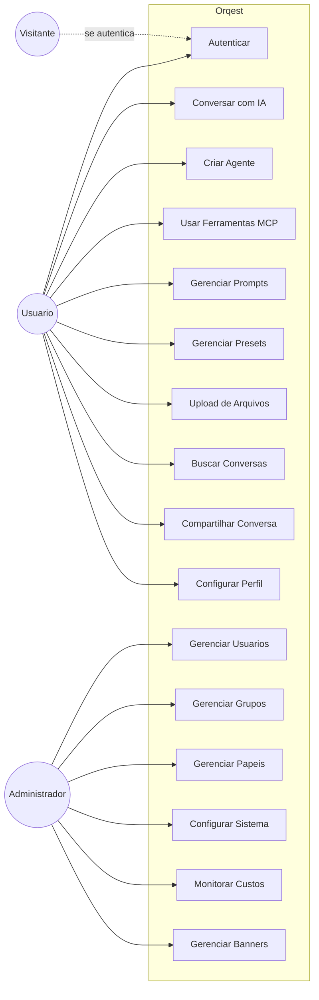
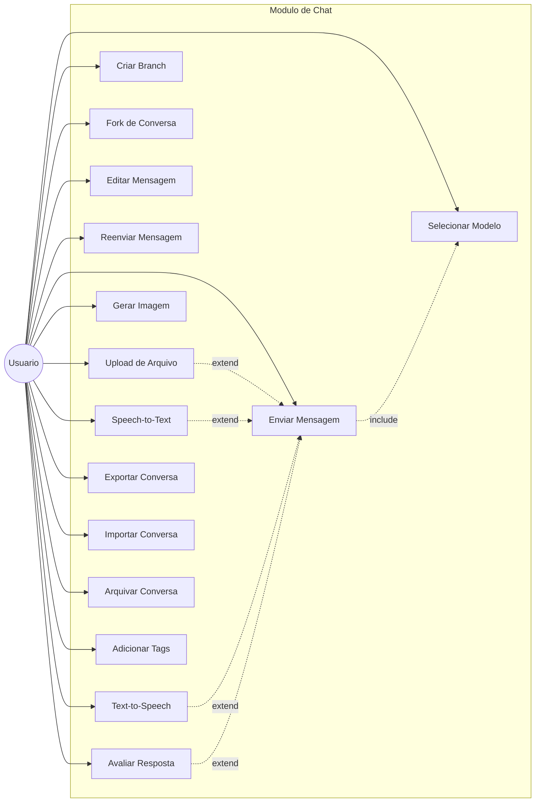
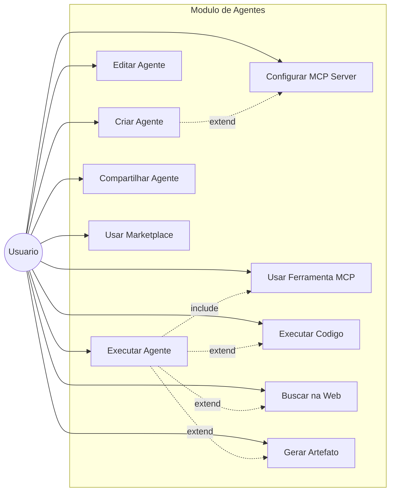
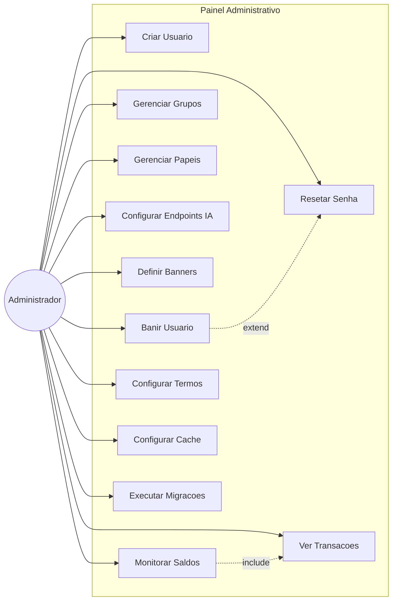

# Orqest (LibreChat Fork)

> Plataforma de conversacao com IA unificada, self-hosted e multi-tenant, com suporte a agentes inteligentes, MCP servers, geracao de imagens, e interpretacao de codigo.

## Visao Geral

Orqest e uma plataforma de chat com inteligencia artificial que permite a usuarios e organizacoes interagir com multiplos provedores de IA (OpenAI, Anthropic, Google, AWS Bedrock, e mais) atraves de uma unica interface moderna e unificada. O sistema foi construido sobre o projeto open-source LibreChat e adiciona recursos enterprise como multi-tenancy, controle de acesso baseado em papeis (RBAC), marketplace de agentes, e integracao com protocolos modernos como MCP (Model Context Protocol).

A plataforma e projetada para ser self-hosted, dando controle total sobre dados e infraestrutura, com suporte a multiplos usuarios, autenticacao via OAuth2/LDAP, e isolamento de dados por tenant. E ideal para empresas que precisam de uma solucao de IA conversacional sob medida, com controle de custos por tokens, seguranca aprimorada, e extensibilidade via agentes e ferramentas personalizadas.

## Funcionalidades Principais

### Chat Unificado com Multiplos Provedores de IA
Converse com diferentes modelos de IA (GPT-4, Claude, Gemini, Llama, etc.) em uma unica interface. Suporta troca de modelo no meio da conversa, presets personalizados, e branching de mensagens (fork).

### Agentes Inteligentes (Orqest Agents)
Crie assistentes de IA especializados sem codigo, com instrucoes personalizadas, ferramentas, e integracoes. Compartilhe agentes com usuarios especificos ou grupos. Suporta execucao de codigo, busca web, e integracoes MCP.

### Model Context Protocol (MCP)
Conecte servidores MCP para estender as capacidades dos agentes com ferramentas externas padronizadas. Permite que agentes acessem APIs, bancos de dados, e servicos externos de forma segura.

### Geracao e Edicao de Imagens
Crie imagens a partir de texto usando DALL-E, Stable Diffusion, Flux, GPT-Image-1, ou MCP servers. Suporta tambem edicao de imagens existentes.

### Code Interpreter / Artifacts
Execute codigo Python, Node.js, Go, C/C++, Java, PHP, Rust, e Fortran em ambiente sandbox. Gere artefatos visuais como graficos, tabelas, e interfaces React/HTML diretamente no chat.

### Busca Web Inteligente
Realize buscas na internet com reranking de resultados para enriquecer o contexto das conversas com informacoes atualizadas.

### Multi-Usuarios e RBAC
Sistema completo de autenticacao (local, OAuth2, LDAP, SAML) com controle de acesso granular baseado em papeis e permissoes. Suporta grupos de usuarios e isolamento por tenant.

### Gestao de Custos e Tokens
Controle de saldo por usuario (token credits), com recarga automatica e rastreamento detalhado de transacoes por modelo e tipo de token.

### Memorias Persistentes
O sistema armazena informacoes personalizadas sobre o usuario (memorias) que sao injetadas no contexto das conversas para respostas mais contextualizadas.

### Importacao e Exportacao
Importe conversas do ChatGPT, Chatbot UI, ou Orqest. Exporte como screenshots, markdown, texto, ou JSON.

### Busca Full-Text
Busca avancada em todas as mensagens e conversas usando Meilisearch.

### Speech-to-Text e Text-to-Speech
Interacao por voz com suporte a OpenAI, Azure OpenAI, e Elevenlabs.

## Status do Projeto

### Completo
| Funcionalidade | Descricao |
|---------------|-----------|
| Chat Multi-Provedor | Conversacao com OpenAI, Anthropic, Google, Bedrock, Azure, e endpoints customizados |
| Sistema de Agentes | Criacao, edicao, compartilhamento e execucao de agentes personalizados |
| MCP Support | Integracao com Model Context Protocol servers |
| Autenticacao | Local, OAuth2 (Google, GitHub, Facebook, Discord, Apple), LDAP, SAML, OpenID |
| RBAC | Papeis e permissoes granulares (agents, prompts, memories, MCP, etc.) |
| Multi-Tenant | Isolamento de dados por tenantId em todas as colecoes |
| Gestao de Arquivos | Upload, processamento e storage de arquivos (local, S3, Firebase) |
| Geracao de Imagens | DALL-E, Stable Diffusion, Flux, GPT-Image-1 |
| Code Interpreter | Execucao sandbox de multiplas linguagens |
| Busca Web | Integracao com provedores de busca e reranking |
| Memorias | Armazenamento de preferencias e fatos sobre usuarios |
| Presets e Prompts | Templates de configuracao e prompts compartilhaveis |
| Admin Panel | Gerenciamento de usuarios, grupos, papeis, configuracoes |
| Resumable Streams | Reconexao automatica de streams SSE sem perda de tokens |
| Mobile-Ready | Interface responsiva com suporte a touch |
| i18n | 20+ idiomas suportados |

### Em Desenvolvimento
| Funcionalidade | Descricao | Prioridade |
|---------------|-----------|------------|
| Marketplace de Agentes | Descoberta e deploy de agentes da comunidade | Media |
| Remote Agents | Agentes executados em infraestrutura remota | Media |

### Planejado
| Funcionalidade | Descricao |
|---------------|-----------|
| Analytics Dashboard | Metricas de uso, custos e engajamento |
| Webhooks Avancados | Notificacoes em tempo real para eventos do sistema |
| Plugin Ecosystem | Sistema de plugins de terceiros |

## Fluxos Principais

### Jornada do Usuario: Primeira Conversa
1. Usuario acessa a aplicacao e faz login (local ou OAuth)
2. Sistema verifica termos de servico e configuracoes pessoais
3. Usuario seleciona um endpoint (OpenAI, Anthropic, etc.) ou um Agente
4. Usuario digita uma mensagem ou faz upload de arquivo/imagem
5. Backend processa a requisicao, gerencia tokens, e chama a API do provedor
6. Resposta e streamada em tempo real para o frontend via SSE
7. Mensagem e salva no MongoDB e indexada no Meilisearch

### Jornada do Administrador
1. Admin acessa o painel de administracao (/admin)
2. Gerencia usuarios (criar, banir, resetar senha)
3. Configura grupos e papeis com permissoes especificas
4. Define banners e mensagens do sistema
5. Configura endpoints de IA e chaves de API
6. Monitora saldos e transacoes de tokens

### Criacao de Agente Inteligente
1. Usuario com permissao acessa o Agent Builder
2. Define nome, descricao, instrucoes do sistema
3. Seleciona modelo de IA e parametros
4. Adiciona ferramentas (MCP servers, busca web, execucao de codigo)
5. Configura nivel de acesso e compartilhamento
6. Publica o agente para uso proprio ou compartilhamento

### Fluxo de Arquivos e RAG
1. Usuario faz upload de arquivo (PDF, imagem, texto)
2. Arquivo e processado e armazenado (local/S3/Firebase)
3. Se aplicavel, arquivo e enviado para RAG API com pgvector
4. Em conversas com Agentes, arquivos podem ser usados para file search ou citations
5. Imagens sao processadas por modelos vision (Claude 3, GPT-4o, Gemini)

### Multi-Device Sync (Resumable Streams)
1. Usuario envia mensagem no celular e comeca a receber resposta streamada
2. Conexao cai (mudanca de rede, app em background, tela bloqueada)
3. Usuario abre o Orqest no desktop ou reconecta no celular
4. Frontend detecta reconexao e chama `/chat/stream/:id?resume=true`
5. Backend retorna estado completo (sync event) com todo o conteudo gerado ate o momento
6. Frontend reconstrói a mensagem parcial na tela instantaneamente
7. Stream continua de onde parou, recebendo novos tokens em tempo real
8. Usuario pode alternar entre dispositivos sem perder contexto ou tokens

## Diagramas de Caso de Uso

### Visao Geral do Sistema

### Casos de Uso: Chat e Conversacao

### Casos de Uso: Agentes e Ferramentas

### Casos de Uso: Administracao

## Glossario

| Termo | Definicao |
|-------|-----------|
| **Endpoint** | Provedor de IA configurado (OpenAI, Anthropic, etc.) |
| **Agente** | Assistente de IA personalizado com instrucoes e ferramentas |
| **MCP** | Model Context Protocol - protocolo para integracao de ferramentas com LLMs |
| **Preset** | Configuracao salva de endpoint/modelo/parametros para reuso |
| **Prompt** | Template de instrucao salvo para reuso em conversas |
| **Token Credit** | Unidade de custo (1000 credits = $0.001 USD) |
| **Tenant** | Isolamento logico de dados (multi-organizacao) |
| **Artifact** | Componente visual gerado no chat (React, HTML, Mermaid) |
| **RAG** | Retrieval-Augmented Generation - busca em documentos para enriquecer respostas |
| **SSE** | Server-Sent Events - streaming de dados do servidor para o cliente |
| **Resumable Stream** | Stream que pode ser reconectado e retomado de onde parou sem perda de dados |
| **Branching** | Criar ramificacoes de conversas a partir de mensagens especificas |

## Metricas e KPIs

- **Usuarios Ativos**: Total de usuarios autenticados por periodo
- **Conversas Criadas**: Volume de novas conversas
- **Tokens Consumidos**: Uso total de tokens (prompt + completion) por modelo
- **Custos por Usuario**: Creditos gastos individualmente
- **Agentes Criados**: Quantidade de agentes personalizados
- **MCP Servers Conectados**: Servidores MCP ativos
- **Taxa de Retencao**: Usuarios retornando apos primeiro uso

---
*Gerado automaticamente em 2026-04-29. Baseado na analise do codebase.*
